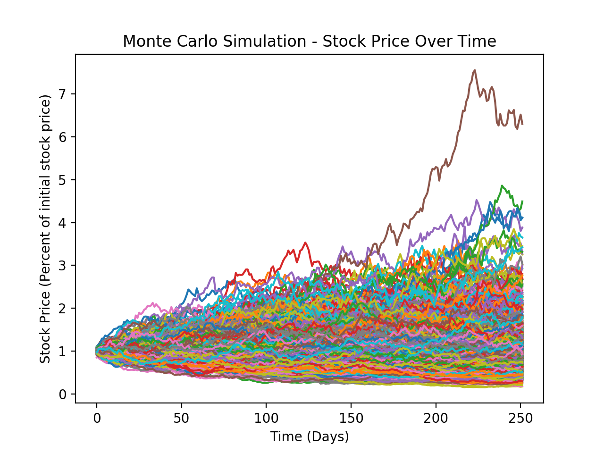
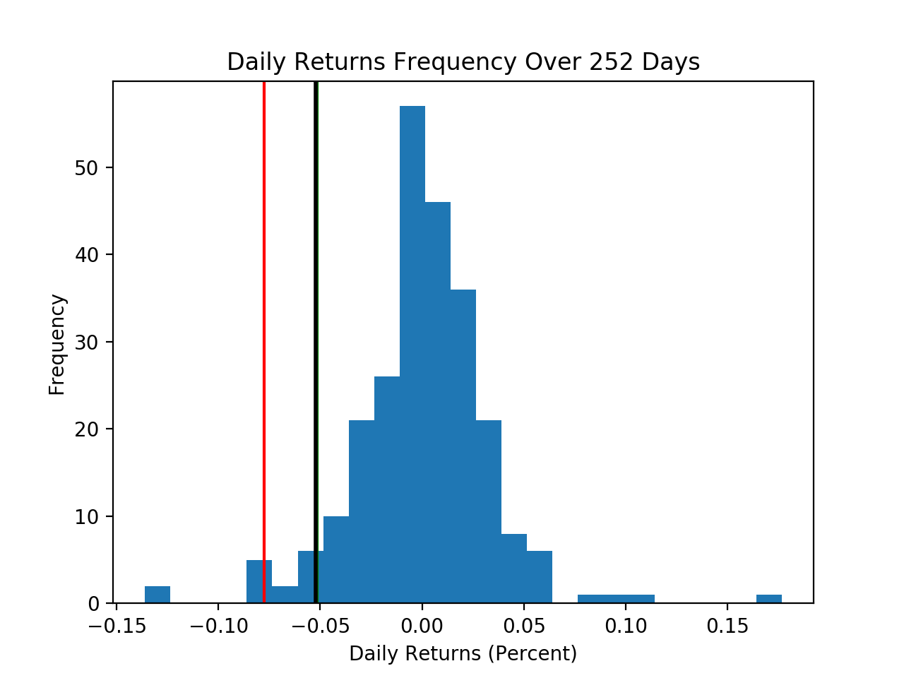

# monte-carlo-var
Monte Carlo simulation in Python that generates 1000 probable future stock prices and computes the averaged Monte Carlo VaR (value-at-risk) for a given stock

Instructions:
1. Go to the working directory where you want to store the Python and .csv files.
2. Download monte-carlo-var.py and TSLA.csv in the desired working directory.
3. Run Python script using the command: python monte-carlo-var.py

Results:

95% value-at-risk (VaR), 95% conditional value-at-risk (CVar), and Monte Carlo averaged VaR:

1000 Monte Carlo simulations of stock price fluctuation over one year:

Histogram of daily returns (from historical data):

General Comments:
- This algorithm can be modified for any stock and any number of Monte Carlo simulations
- The Monte Carlo simulation is based on statistical data (mean, standard deviation) from the input data.
- The VaR and CVar values are based on the input data, but the Monte Carlo VaR is based on data from a random variable. This means every time the algorithm is run, the VaR and CVar values remain the same, but the Monte Carlo VaR changes.
- Subsequently, the Monte Carlo simulation plot changes with each run of the algorithm.
- Conceptually, stocks with greater volatility tend to have greater fluctuations over time.
- The Monte Carlo simulation plot is scaled based on the initial stock price (ex. at the end of one year, a given simulation with a value of 2 means the stock price doubled over one year).
